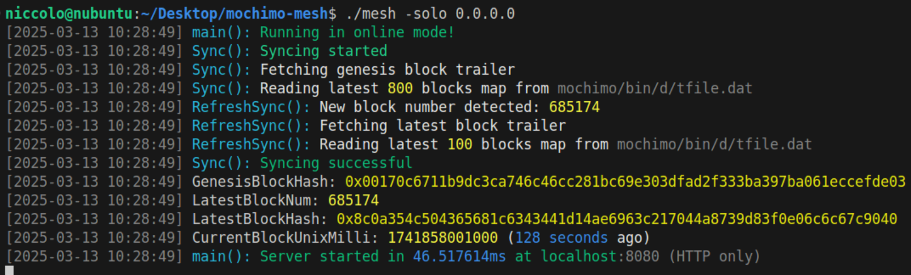

# Mochimo Mesh API v1.5.1




The official Mochimo API, following the Rosetta standard, for interacting with the Mochimo blockchain.

## Quick Start

1.  **Using Public Endpoints**:

    Start exploring the Mochimo Mesh API immediately using our public endpoints. See [Query Examples](.github/QUERY_EXAMPLES.md) for example queries.

    -   `https://api.mochimo.org`
    -   `http://35.208.202.76:8080`

2.  **Manual Setup (Local Node)**:

    To connect to a local Mochimo node:

    1.  Clone and build:

        ```bash
        git clone https://github.com/NickP005/mochimo-mesh.git
        cd mochimo-mesh
        go build -o mesh .
        ```

    2.  Ensure Mochimo node is running and synced under the `mochimo/bin/` subfolder:

        ```bash
        git clone https://github.com/mochimodev/mochimo mochimo/
        cd mochimo/
        make mochimo
        cd bin/
        ./gomochi -d # Consider running the node in a separate screen or service
        cd ..
        ```

        For more accurate and complex configuration, follow the guide at [github.com/mochimodev/mochimo](https://github.com/mochimodev/mochimo). These processes should ideally be run as a service.

    3.  Run:

        ```bash
        ./mesh -solo 0.0.0.0         # Connect to local node
        ./mesh -p 8081               # Custom port
        ./mesh -cert cert.pem -key key.pem  # Enable HTTPS
        ```

        For more configuration options, see the [Command Line Flags](#command-line-flags) section.

3.  **Docker Setup**:

    Docker setup is currently a work in progress. Feel free to contribute :)

## API Endpoints

All endpoints accept POST requests with JSON payloads.

For detailed examples on how to use these endpoints, see our [Query Examples](.github/QUERY_EXAMPLES.md) documentation.

### Network

-   `/network/list` - List supported networks
-   `/network/status` - Get chain status (*)
-   `/network/options` - Get network options

### Account

-   `/account/balance` - Get address balance (*)
    -   Address format: "0x" + hex string

### Block

-   `/block` - Get block by number or hash (*)
-   `/block/transaction` - Get transaction details (*)

### Mempool

-   `/mempool` - List pending transactions' id (*)
-   `/mempool/transaction` - Get pending transactison (*)

### Construction

-   `/construction/derive` - Derive address from public key
-   `/construction/preprocess` - Prepare transaction
-   `/construction/metadata` - Get transaction metadata (*)
-   `/construction/payloads` - Create unsigned transaction (*)
-   `/construction/combine` - Add signatures
-   `/construction/submit` - Submit transaction (*)

### Custom Methods

-   `/call` - tag_resolve: Resolve tag to address (*)

### Indexer Endpoints (Optional)

These endpoints are available if the indexer is enabled.

-   `/search/transactions` - Search for transactions with various filters (requires indexer)
-   `/events/blocks` - Track block additions and removals as sequenced events (requires indexer)

### Statistics Endpoints (Optional)

These endpoints are available if a ledger file path is specified.

-   `/stats/richlist` - Get accounts with highest balances (requires ledger path)

(*) Requires online mode (-online flag set to true, as default)

## Configuration

### Command Line Flags

| Flag               | Type     | Default                     | Description                                                                 |
| :----------------- | :------- | :-------------------------- | :-------------------------------------------------------------------------- |
| `-settings`         | string   | "interface_settings.json"   | Path to interface settings file                                             |
| `-tfile`           | string   | "mochimo/bin/d/tfile.dat"   | Path to node's tfile.dat file                                             |
| `-txclean`         | string   | "mochimo/bin/d/txclean.dat" | Path to node's txclean.dat file                                           |
| `-fp`               | float    | 0.4                         | Lower percentile of fees from recent blocks                                 |
| `-refresh_interval` | duration | 5s                          | Sync refresh interval in seconds                                            |
| `-ledger`           | string   | ""                          | Path to ledger.dat file for statistics endpoints                           |
| `-ledger_refresh`   | duration | 900s                       | Refresh interval for ledger cache in seconds                               |
| `-ll`               | int      | 5                           | Log level (1-5, Least to most verbose)                                     |
| `-solo`             | string   | ""                          | Single node IP bypass (e.g., "0.0.0.0")                                    |
| `-p`                | int      | 8080                        | HTTP port                                                                 |
| `-ptls`             | int      | 8443                        | HTTPS port                                                                |
| `-online`           | bool     | true                        | Run in online mode                                                        |
| `-cert`             | string   | ""                          | Path to SSL certificate file                                              |
| `-key`              | string   | ""                          | Path to SSL private key file                                              |
| `-indexer`          | bool     | false                       | Enable the indexer                                                        |
| `-dbh`              | string   | "localhost"                 | Indexer host                                                              |
| `-dbp`              | int      | 3306                        | Indexer port                                                              |
| `-dbu`              | string   | "root"                      | Indexer user                                                              |
| `-dbpw`             | string   | ""                          | Indexer password                                                          |
| `-dbdb`             | string   | "mochimo"                   | Indexer database                                                          |

### Environment Variables

-   `MCM_CERT_FILE`: Path to SSL certificate
-   `MCM_KEY_FILE`: Path to SSL private key
-   `MCM_LEDGER_PATH`: Path to ledger.dat file for statistics endpoints

## HTTPS Configuration

Enable HTTPS using either method:

1.  **Obtaining SSL Certificates (Optional)**:

    Certbot can be used to automatically obtain and renew SSL certificates from Let's Encrypt. Follow these steps to set up Certbot:

    -   Install Certbot:

        ```bash
        sudo apt-get update
        sudo apt-get install certbot
        ```

    -   Obtain a certificate:

        ```bash
        sudo certbot certonly --standalone -d yourdomain.com
        ```

    -   Set up a cron job to renew the certificate automatically:

        ```bash
        sudo crontab -e
        ```

        Add the following line to the crontab file to renew the certificate every day at noon:

        ```bash
        0 12 * * * /usr/bin/certbot renew --quiet
        ```

2.  **Configuring HTTPS**:

    Provide the API the paths to the certificate and key using either command line flags or environment variables:  
    
      **Option A: Command Line Flags**

      ```
      -cert string      Path to SSL certificate file
      -key string       Path to SSL private key file
      ```

      **Option B: Environment Variables**

      -   `MCM_CERT_FILE`: Path to SSL certificate (alternative to `-cert` flag)
      -   `MCM_KEY_FILE`: Path to SSL private key (alternative to `-key` flag)

      Example:

      ```bash
      export MCM_CERT_FILE=/etc/letsencrypt/live/yourdomain.com/fullchain.pem
      export MCM_KEY_FILE=/etc/letsencrypt/live/yourdomain.com/privkey.pem
      ```

## Indexer Setup

To enable the indexer, you need to configure the database connection and enable the indexer flag.

1.  **Database Setup**:

    -   Ensure you have a MySQL or MariaDB database server running.
    -   Create a database named `mochimo` (or specify a different name using the `-dbdb` flag).
    -   Create a user with the necessary privileges to access the database (or use the root user, but it's not recommended for production).
    -   **Important**: Generate the necessary tables in your database by using the [TABLE_SCHEMA.sql](indexer/TABLE_SCHEMA.sql) file. This file contains the SQL schema required for the indexer to function correctly.

2.  **Configuration**:

    You can configure the indexer using command-line flags:

    ```
    -indexer bool   Enable the indexer
    -dbh string     Indexer host (default: "localhost")
    -dbp int       Indexer port (default: 3306)
    -dbu string     Indexer user (default: "root")
    -dbpw string    Indexer password (default: "")
    -dbdb string    Indexer database (default: "mochimo")
    ```

3.  **Running with Indexer**:

    To run the mesh with the indexer enabled, use the `-indexer` flag along with the database configuration flags:

    ```bash
    ./mesh -indexer -dbh your_db_host -dbp your_db_port -dbu your_db_user -dbpw your_db_password -dbdb your_db_name
    ```

## Statistics Configuration

To enable the statistics endpoints, you need to provide a path to the Mochimo ledger file.

1.  **Ledger File**:

    The ledger.dat file contains the current state of all accounts on the Mochimo blockchain. If you're running a full Mochimo node, this file is typically located at `mochimo/bin/d/ledger.dat`.

2.  **Configuration**:

    You can configure the statistics functionality using command-line flags:

    ```
    -ledger string       Path to ledger.dat file (default: "")
    -ledger_refresh duration  Refresh interval for ledger cache (default: 15m)
    ```

3.  **Running with Statistics Enabled**:

    To run the mesh with statistics endpoints enabled, use the `-ledger` flag to specify the path to your ledger.dat file:

    ```bash
    ./mesh -ledger mochimo/bin/d/ledger.dat
    ```

    Alternatively, you can use the `MCM_LEDGER_PATH` environment variable:

    ```bash
    export MCM_LEDGER_PATH=mochimo/bin/d/ledger.dat
    ./mesh
    ```

4.  **Available Statistics Endpoints**:

    When statistics is enabled, the following endpoints are available:

    -   `/stats/richlist` - Get accounts with highest balances

    See the [Query Examples](.github/QUERY_EXAMPLES.md#stats-richlist) for usage examples.

## Technical Details

-   Currency Symbol: MCM
-   Decimals: 9 (1 MCM = 10^9 nanoMCM)
-   Block Sync: Requires `mochimo/bin/d/tfile.dat` access (if no other path is specified in the flags)
-   Mempool Endpoint: Requires access to `mochimo/bin/d/txclean.dat`
-   Node Communication: Local node on specified IP/port
-   Statistics Endpoints: Requires access to `mochimo/bin/d/ledger.dat` (or path specified in flags)

## Address Types

-   **Tag**: 20 bytes (hex encoded with "0x" prefix)
-   **Address**: 20 bytes (hex encoded with "0x" prefix)
-   **Tagged Address**: 40 bytes (hex encoded with "0x" prefix)

## Error Codes

| Code | Message           | Retriable |
| :--- | :---------------- | :-------- |
| 1    | Invalid request   | false     |
| 2    | Internal error    | true      |
| 3    | TX not found      | true      |
| 4    | Account not found | true      |
| 5    | Wrong network     | false     |
| 6    | Block not found   | true      |
| 7    | Wrong curve type  | false     |
| 8    | Invalid address   | false     |

# Support & Community

Join our communities for support and discussions:

<div align="center">

[](https://discord.gg/Q5jM8HJhNT)
[](https://discord.gg/SvdXdr2j3Y)

</div>

-   **NickP005 Development Server**: Technical support and development discussions
-   **Mochimo Official**: General Mochimo blockchain discussions and community